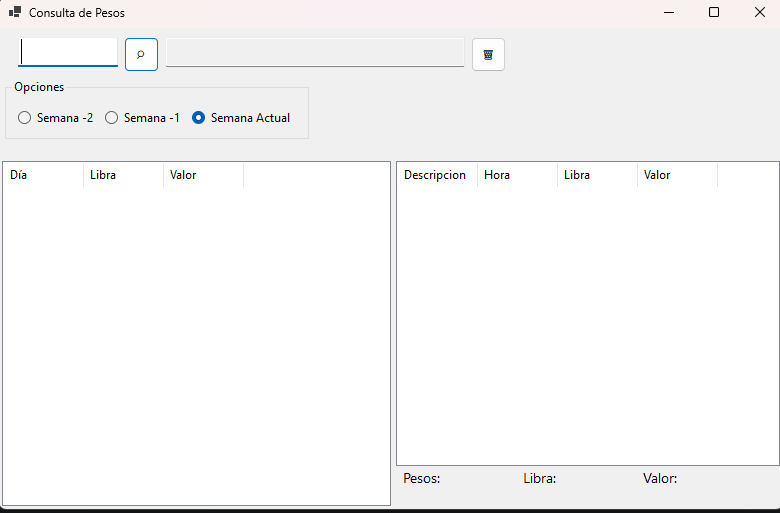

# 📊 ConsultaPeso – Sistema de Consulta de Pesos (Modo Kiosco)

Aplicación de escritorio desarrollada en **.NET 6 (WinForms)** para la **consulta de pesos por empleado**, diseñada para operar en **modo kiosco**, con **lectura automática por tarjeta / RFID / código de barras**, y pensada para **PCs de bajos recursos** en entornos industriales.

---

## 🖥️ Vista general de la aplicación

> Imagen referencial del sistema en modo kiosco (puede reemplazarse por una captura real):
> 
> 

---

## 🎯 Objetivo del proyecto

- Consulta rápida de información por **empleado**
- Operación **sin teclado ni mouse** (solo lector)
- Uso en **plantas, empacadoras, fábricas o camaroneras**
- Funcionamiento estable 24/7
- Recuperación automática ante fallos
- Evitar manipulación por parte del usuario final

---

## ⚙️ Tecnologías utilizadas

- **.NET 6 (WinForms)**  
  Elegido por:
  - Compatibilidad con PCs antiguos
  - Bajo consumo de recursos
  - Estabilidad en entornos industriales
  - No requiere runtimes modernos pesados

- **C#**
- **HttpClient** (instancia única)
- **Arquitectura por capas**
- **Modo Kiosco**
- **Git / GitHub**

---

## 🧱 Arquitectura del proyecto

```
ConsultaPeso
│
├── Application
│   ├── Services
│   │   └── ConsultaPesosService.cs
│   │
│   ├── Readers
│   │   ├── ICardReader.cs
│   │   ├── BarcodeKeyboardReader.cs
│   │   ├── QrKeyboardReader.cs
│   │   └── MagneticCardReader.cs
│   │
│   ├── Models
│   │   ├── Peso.cs
│   │   ├── ConsultaSemana.cs
│   │   └── Empleado.cs
│   │
│   └── Enums
│       └── PeriodoSemana.cs
│
├── Infrastructure
│   ├── Api
│   │   └── ApiClient.cs
│   │
│   └── (futuro: logging, repositorios, etc.)
│
├── UI
│   ├── Forms
│   │   └── MainForm.cs
│   │
│   ├── Controls
│   │   └── TotalesBar.cs
│   │
│   └── Layout
│       └── HeaderLayout.cs
│
├── Program.cs
└── ConsultaPeso.csproj
```

---

## 🧠 Principios de diseño

- ❌ No lógica de negocio en la UI
- ❌ No dependencias directas entre capas
- ✔ Servicios desacoplados
- ✔ Lectores basados en eventos
- ✔ Código mantenible y extensible

---

## 🪪 Lectura de tarjetas / códigos

La aplicación soporta múltiples tipos de lectura **sin cambiar la UI**:

### Tipos soportados
- ✔ Tarjetas RFID (emuladas como teclado)
- ✔ Código de barras
- ✔ Código QR
- ✔ Tarjeta magnética (banda)

### Interfaz base
```csharp
public interface ICardReader
{
    event EventHandler<string> CardRead;
    void ProcessKey(char keyChar);
    void Reset();
}
```

---

## 🖱️ Modo Kiosco

- Pantalla completa
- Sin bordes
- Sin barra de tareas
- Sin clic derecho
- Sin ALT+F4
- Instancia única
- Salida solo mediante combinación administrativa

---

## 🔄 Estabilidad y recuperación

- Manejo global de excepciones
- Registro de errores (`crash.log`)
- Reinicio automático ante fallos
- Protección contra loops de reinicio

---

## 🔐 Seguridad de ejecución

- Instancia única usando `Mutex`
- Evita múltiples ejecuciones accidentales
- Ideal para entornos de producción

---

## 🚀 Rendimiento y compatibilidad

- Optimizada para **PCs de bajos recursos**
- Ideal para:
  - PCs antiguos
  - Equipos industriales
  - Máquinas sin GPU

---

## 🛠️ Requisitos

- Windows 10 o superior
- .NET 6 Runtime
- Lector HID (RFID / código de barras / QR)

---

## 📦 Instalación

1. Clonar el repositorio
2. Compilar en **Release**
3. Copiar en el equipo destino
4. (Opcional) Configurar inicio automático en Windows

---

## 👨‍💻 Autor

Desarrollado por **CryGeo**  
Backend Developer (.NET / C#)

---

## 📄 Licencia

Uso interno / empresarial.
